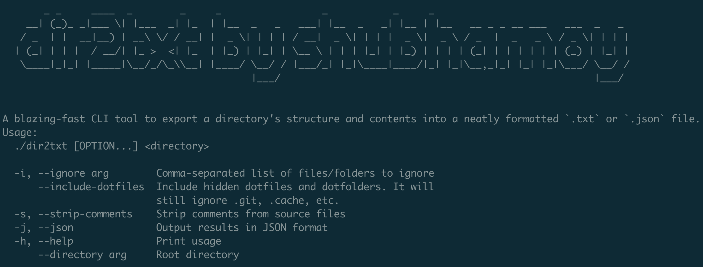

# dir2txt

Turn your entire project directory into a clean, readable, and AI-friendly output — effortlessly. A blazing-fast CLI tool to export a directory's structure and contents into a neatly formatted `.txt` or `.json` file.

[](https://opensource.org/licenses/MIT)

---

## 🔍 Features

- 📁 Generates a beautiful directory tree view
- 📄 Dumps actual file contents (optionally stripped of comments)
- 🎯 Respects `.gitignore`, `.dockerignore`, and custom ignore files
- 🧠 Smart binary file detection (skips them)
- 🧠 Outputs in **text** or **structured JSON** — perfect for feeding into AI pipelines

---
## 🤖 Built for AI & LLM Workflows

Working with GPT-based agents? Retrieval-Augmented Generation (RAG)? Code-aware copilots?  
**dir2txt** simplifies the first step: **structuring your codebase for context ingestion**.

Use it to:

✅ Prepare prompt-friendly project dumps for ChatGPT or Claude  
✅ Feed clean file trees + contents into a vector database  
✅ Preprocess source code for embedding + search  
✅ Power local AI agents that operate on code  
✅ Automate audits, changelogs, and debugging assistants

> Instead of manually collecting files or asking LLMs to interpret a directory — `dir2txt` gives them context on a silver platter.

---

## 🖼️ Screenshot



---

## 🛠️ Usage

```bash
dir2txt ./my-project \
  --ignore node_modules,build \
  --strip-comments \
  --include-dotfiles \
  --json
```
---

## 🛠️ Build Instructions

✅ Prerequisites
```
A C++20 compatible compiler:
- macOS: Apple Clang 14+ or g++-13 via Homebrew
- Linux: g++ 10 or newer
CMake 3.16 or higher
git (to clone the repo)
```
### 🔧 Build (macOS)

```bash
git clone https://github.com/shubhamoy/dir2txt.git
cd dir2txt
mkdir build && cd build
cmake ..
cmake --build .
./dir2txt
```